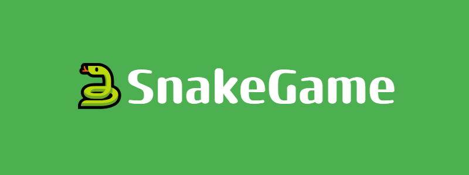
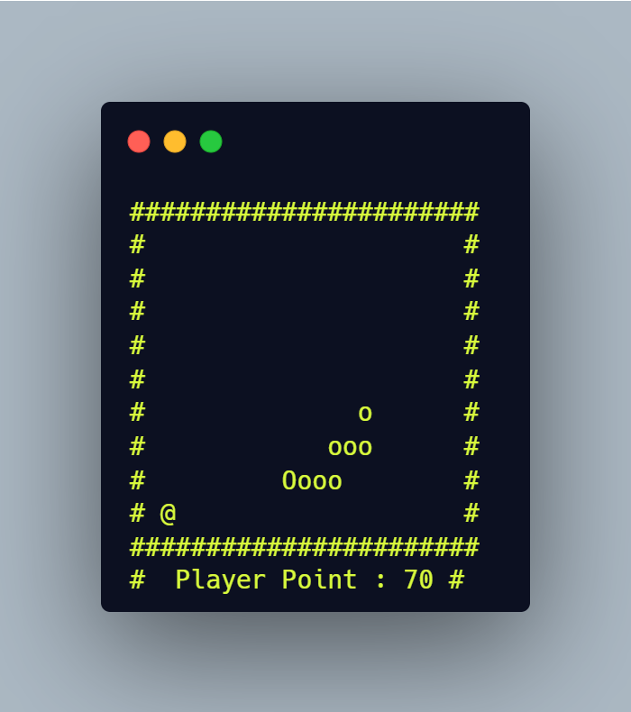

This is a terminal based cpp snake game. Player tries to get big as much as he can.
# 🎮 Gameplay
the goal is getting bigger. We control our snake with
" W, A, S, D ". Eat the fruits and get point , get bigger. Try not to hit the walls or yourself.

* W -> Up
* S -> Down
* A -> Left 
* D -> Right




# 🗃️ File Structure
* `snake.cpp` : main file of the game
* `Board.h` : draws the board and manages
* `Meteor.h` : creates and controls meteor class
* `Player.h` : creates and manages player class
* `Tail.h` : creates and manages the tail


# 🛠️ Compile and Run
* Clone or download the repo
```sh
git clone https://github.com/furkansarsilmaz/SnakeGame.git

cd SnakeGame
```
* Compile the code
```sh
g++ -o SnakeGame snake.cpp
```
* Execute the code
```sh
./SnakeGame
```
# 📜 Notes
This project only tested on Windows. It's open source project and you can develop and share if you wish.